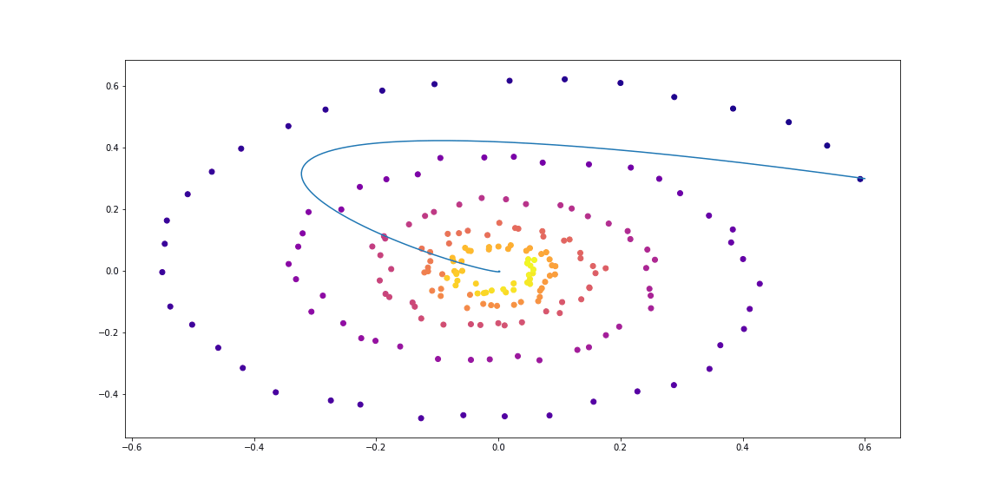
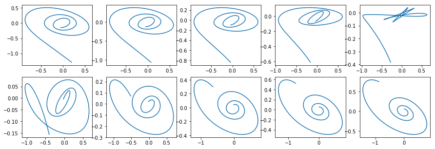

# Neural ODEs

[Notebook](https://nbviewer.jupyter.org/github/urtrial/neural_ode/blob/master/Neural%20ODEs.ipynb) here collects theory, basic implementation and some experiments of [*Neural Ordinary Differential Equations*](https://arxiv.org/abs/1806.07366) [1].

[Link to NBViewer](https://nbviewer.jupyter.org/github/urtrial/neural_ode/blob/master/Neural%20ODEs.ipynb)  
[Link to NBViewer (Russian)](https://nbviewer.jupyter.org/github/urtrial/neural_ode/blob/master/Neural%20ODEs%20(Russian).ipynb)

**For actual usage consider using authors [original implementation](https://github.com/rtqichen/torchdiffeq)**

# References

[[1]](https://arxiv.org/abs/1806.07366) Ricky T. Q. Chen, Yulia Rubanova, Jesse Bettencourt, David Duvenaud. "Neural Ordinary Differential Equations." Advances in Neural Processing Information Systems. 2018.
